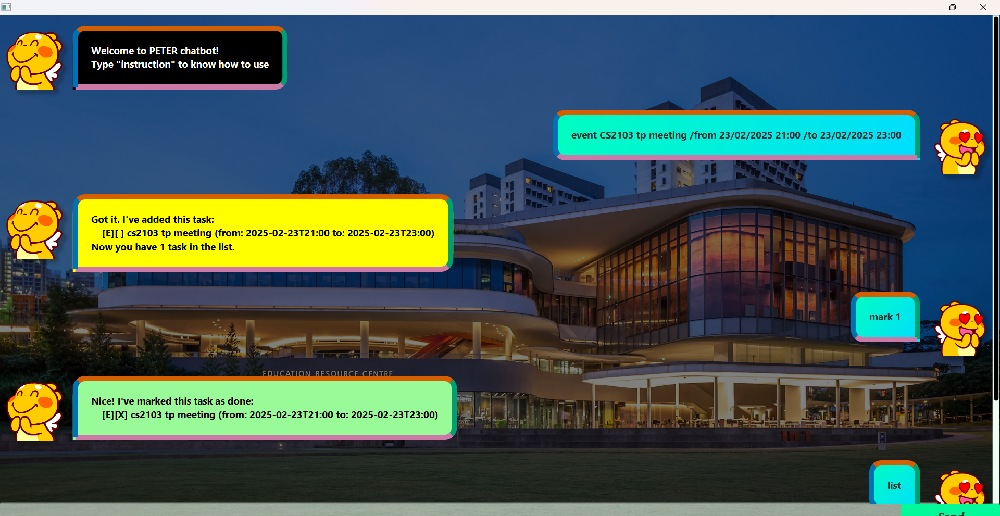

# Peter Task Management Chatbot

Welcome to **Peter** – a simple, yet powerful, task management chatbot that helps you organize your tasks efficiently. Whether you need to add, update, or track tasks, Peter is here to streamline your workflow with an intuitive command-based interface.

  

## Introduction

Peter is designed to help you manage your daily tasks effortlessly. With support for todos, deadlines, and events, Peter lets you add, update, delete, and mark tasks as done or not done—all through simple chat commands. This tool is perfect for individuals who prefer a lightweight, conversational approach to task management.

## Features

- **Task Listing:** View all tasks or filter by keyword.
- **Task Creation:** Quickly add new todos, deadlines, or events.
- **Task Updates:** Modify task details including description, deadlines, start times, and end times.
- **Task Completion:** Mark tasks as done or not done.
- **Task Deletion:** Remove individual tasks or clear the entire list.
- **Count Tasks:** Check the number of tasks on your list.
- **Flexible Date & Time Format:** All date and time inputs should follow the format `dd/MM/yyyy HH:mm`.

## Usage Guide

Interact with Peter using the following commands:

### Basic Commands

- **List all tasks:**  
  `list`

- **delete task i:**  
  `delete <i>`

- **delete all the tasks in your list::**  
  `reset`

- **show the number of tasks in your list:**  
  `count`

- **mark task i in your list as done:**  
  `mark <i>`

- **mark the task i in your list as not done:**  
  `unmark <i>`

- **list all the tasks matching a keyword:**  
  `find <keyword>`

- **update task i description in your list:**  
  `update <i> /description 
`

- **update task i deadline in your list:**  
  `update <i> /by <time>`

- **update task i start time in your list:**  
  `update <i> /from <time>`

- **update task i end time in your list:**  
  `update <i> /to <time>`

- **add new todo:**  
  `todo <name>`

- **add new deadline:**  
  `deadline <name> /by <time>`

- **add new event:**  
  `event <name> /from <time> /to <time>`
