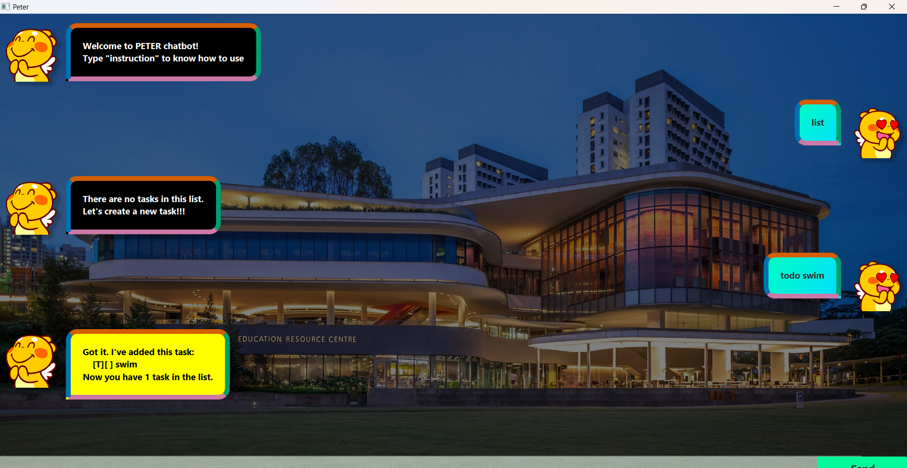

# Peter Task Management Chatbot

Welcome to **Peter** – a simple, yet powerful, task management chatbot that helps you organize your tasks efficiently. Whether you need to add, update, or track tasks, Peter is here to streamline your workflow with an intuitive command-based interface.

  

## Introduction

Peter is designed to help you manage your daily tasks effortlessly. With support for todos, deadlines, and events, Peter lets you add, update, delete, and mark tasks as done or not done—all through simple chat commands. This tool is perfect for individuals who prefer a lightweight, conversational approach to task management.

## Features

- **Task Listing:** View all tasks or filter by keyword.
- **Task Creation:** Quickly add new todos, deadlines, or events.
- **Task Updates:** Modify task details including description, deadlines, start times, and end times.
- **Task Completion:** Mark tasks as done or not done.
- **Task Deletion:** Remove individual tasks or clear the entire list.
- **Count Tasks:** Check the number of tasks on your list.
- **Flexible Date & Time Format:** All date and time inputs should follow the format `dd/MM/yyyy HH:mm`.

## Quick Start

- Ensure you have Java 17 or higher installed on your computer.
- Download the latest `.jar` file from the [release page](https://github.com/NHT020305/ip/releases).
- Move the `.jar` file to the desired home directory for your application.
- Open the file to launch the application. A GUI should appear within a few seconds.
- Enter a command in the command box and press Enter or click "Send" to execute it.

## Usage Guide

Interact with Peter using the following commands:

### Basic Commands

- **list all tasks:**  `list`
    
    Example: `list`
    
    Output: 
    
        Here are the tasks in your list:
            <Task 1> 
            <Task 2>
            ....

- **delete task i:**  `delete <i>`
    
    Example: `delete 1`
    
    Output:

        Noted. I've removed this task:
            <Task 1>
        Now you have 2 tasks in the list.

- **delete all the tasks in your list::**  `reset`
    
    Example: `reset`
    
    Output:
    
        Got it. Now your task list is empty.
        Let's create a new task!!!

- **show the number of tasks in your list:**  `count`
  
    Example: `count`

    Output:

        You have 3 task%s in the list.

- **mark task i in your list as done:**  `mark <i>`
    
    Example: `mark 1`

    Output:

        Nice! I've marked this task as done:
            <Task 1>

- **mark the task i in your list as not done:**  `unmark <i>`

    Example: `mark 1`

    Output:

        Nice! I've marked this task as done:
            <Task 1>

- **list all the tasks matching a keyword:**  `find <keyword>`

    Example: `find play`

    Output:

        Here are the tasks in your list matching "play":
            <Task 1>
            <Task 2>
        Number of results: 2

- **update task i description in your list:**  `update <i> /description 
`

    Example: `update 2 /desciption "play"`

    Output:

        Nice! I've updated this task as following:
            <Updated task 2>

- **update task i deadline in your list:**  `update <i> /by <time>`

    Example: `update 3 /by 18/03/2025 23:59`

    Output:

        Nice! I've updated this task as following:
            <Updated deadline 3>

- **update task i start time in your list:**  `update <i> /from <time>`

    Example: `update 4 /from 18/03/2025 11:00`

    Output:

        Nice! I've updated this task as following:
            <Updated event 4>

- **update task i end time in your list:**  `update <i> /to <time>`

    Example: `update 4 /to 18/03/2025 11:00`

    Output:

        Nice! I've updated this task as following:
            <Updated event 4>;

- **add new todo:**  `todo <name>`

    Example: `todo play badminton`

    Output:

        Got it. I've added this task:
            [T][] play badminton
        Now you have 3 tasks in the list.

- **add new deadline:**  `deadline <name> /by <time>`

    Example: `deadline do homework 20/03/2025 23:59`

    Output:

        Got it. I've added this task:
            [D][] do home work (by: 2023-03-20T23:59)
        Now you have 3 tasks in the list.

- **add new event:**  `event <name> /from <time> /to <time>`

    Example: `event meeting /from 20/03/2025 15:00 /to 20/03/2025 16:00`

    Output:

        Got it. I've added this task:
            [E][] meeting (from: 2025-03-20T15:00 to: 2025-03-20T16:00)
        Now you have 3 tasks in the list.

- **exit Peter chatbot:**  `bye`
